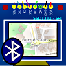
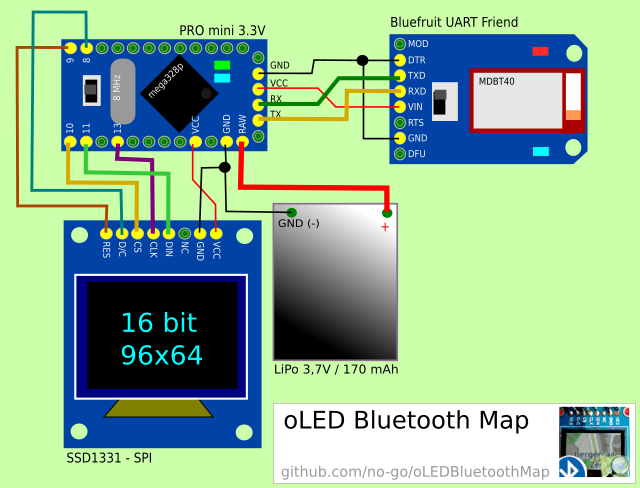
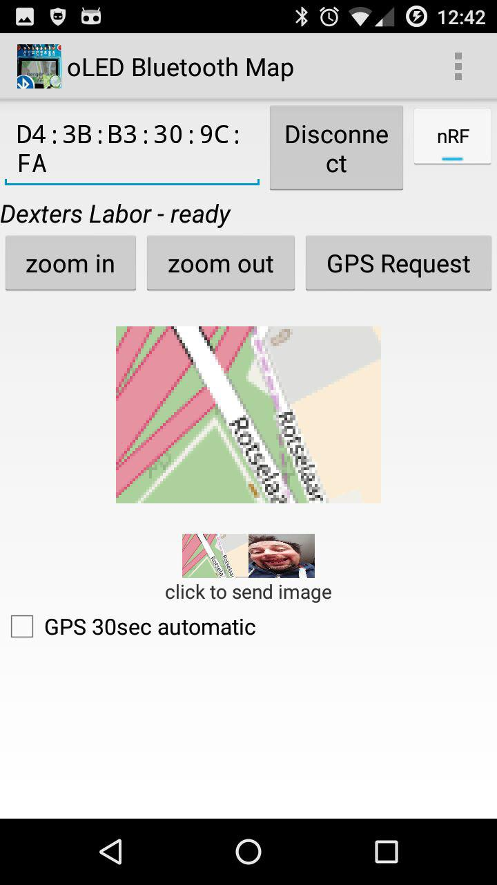
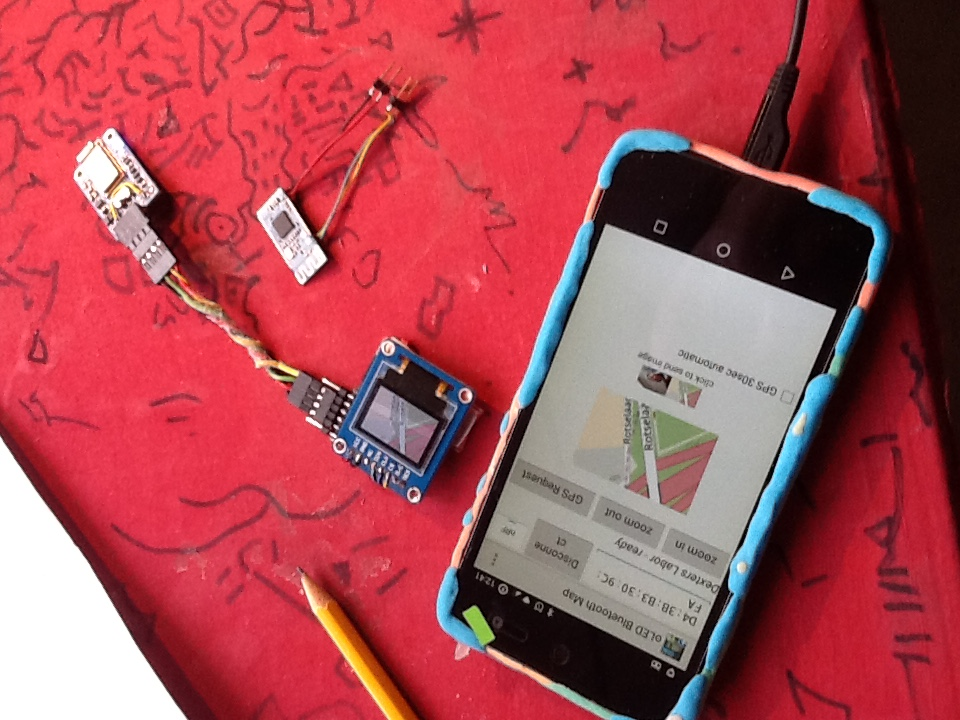

# oLED Bluetooth Map

Get position from smartphone, generates a map from osm, send map via UART bluefruit to a RGB display.
App can take pictures and sends them, too! You can switch between nRF (bluefrui) or HM10 (CC2541)
Bluetooth module.

Support me: 

[APK File](https://raw.githubusercontent.com/no-go/oLEDBluetoothMap/hm10_cc2541/app/app-release.apk) or (in future) get the App from [google play](https://play.google.com/store/apps/details?id=click.dummer.oLEDBluetoothMap).

## App Icon

## Circuit

## Screenshots

## Privacy policy

Google Play requires me to disclose this App will take camera pictures and needs access to your position. 
This App caches the map on your phone. Thus it needs access to your files. The files or your position is not send to me and everything is realy private :-D Ok, OpenStreet Map needs the position to generate the map. Ask them, what they are doing with that stuff :-/ The cam picture does not send it to a network (just bluetooth) or is stored permanently on your phone.
