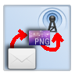

# oLED Bluetooth Map

Get position from smartphone, generates a map from osm, send map via UART bluefruit to a RGB display.
App can take pictures and sends them, too! You can switch between nRF (bluefruit) or HM10 (CC2541)
Bluetooth module. For feather M0 you need my SSD1331 lib (Adafruit based) and switch the app to *nRF* and *slow*.

If you garant the App notification access, it will send App icon and notification!

I add a golang websocket server - the app can send the image to that server. The server stores it as out.png file.

Support me: 

Get the App from [google play](https://play.google.com/store/apps/details?id=click.dummer.oLEDBluetoothMap).

## App Icon

## Circuit

## Screenshots

Some screenshots are from old App versions.

Examples with Notification access (you need to change your android settings).

## Privacy policy

Google Play requires me to disclose this App will take camera pictures, needs access to your position and access to your files.

### Personal information.

Personal information is data that can be used to uniquely identify or contact a single person. I DO NOT collect, transmit, store or use any personal information while you use this app. This App use OpenStreet Map. OpenStreet Map needs the position to generate a map. Please read the *Privacy policy* of OpenStreetMap (osm), how they handle this data.

The App needs access to:

 -  Camera: to take and send an image to your private bluetooth device or your private websocket server. The image is not permanently stored on your phone.
 -  Files: The osm part of the app caches the map on your phone. It does not read or touch any other files.
 -  Position: The osm part of the app needs your position to generate a map for this position. 
 -  Network: The osm feature needs access to the internet to loads map tiles. You can use a private Websocket server and send the images (cam, notification, map) without encryption (!) to it.
 -  Bluetooth: The App sends data to your Do-It-Yourself Bluetooth device.

### Non-Personal information.

I DO NOT collect non-personal information like user's behavior:

 -  to solve App problems
 -  to show personalized ads

The google play store collect non-personal information such as the data of install (country and equipment).

### Privacy Questions.

If you have any questions or concerns about my Privacy Policy or data processing, please contact me.
